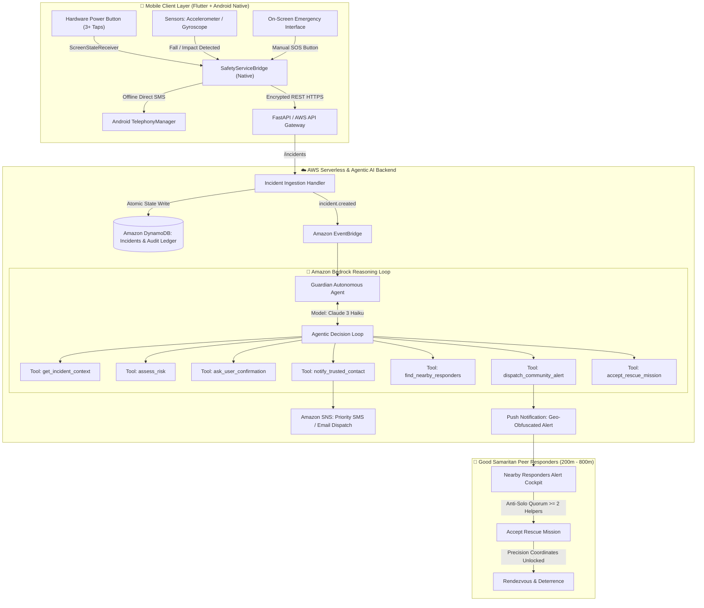

# 🛡️ Guardian: Autonomous Agentic Emergency Response & Personal Safety Platform

[](https://aws.amazon.com/)
[](https://aws.amazon.com/bedrock/)
[](https://flutter.dev/)
[](https://www.openstreetmap.org/)
[]()
[](LICENSE)

---

## 1. Executive Summary: The 2-to-5 Minute Survival Window

Traditional personal safety applications suffer from a catastrophic structural limitation: **The Response Time Dilemma**.

1. **Emergency Services (112 / 911 / Police)**: Average arrival times range from **15 to 45 minutes** in suburban, rural, or congested urban areas at night.
2. **Personal / Family Contacts**: Frequently reside far away, have phones on silent during sleep hours, or are physically incapable of immediate intervention.

> **In active street harassment, stalkings, physical assaults, or sudden medical collapses, the critical survival window is between 2 and 5 minutes.**

**Guardian** bridges this survival gap by turning everyday smartphones into an **autonomous, agentic emergency-response mesh**:
* **Covert Physical Hardware Trigger**: 3+ rapid taps on the physical hardware power button triggers an instant panic signal—no screen unlock, no app launch, and zero display illumination.
* **Autonomous AWS Bedrock Agent (Claude 3 Haiku)**: Evaluates real-time multimodal context (kinematic sensor spikes, ambient time, geohash danger indices, safe zone proximity) and autonomously orchestrates escalation without human bottlenecks.
* **Hyper-Local Peer-to-Peer Good Samaritan Network**: Alerts nearby verified Guardian users (within 200m–800m) to provide collective, non-violent presence and deterrence before first responders arrive.
* **100% Free Open-Source Geospatial Stack**: Powered entirely by OpenStreetMap (OSM), Nominatim, and OSRM—zero Google Maps billing or API key requirements.
* **Dual-Channel Zero-Internet Fallback**: If cellular data is offline or in a basement dead zone, direct hardware SMS sends GPS coordinates instantly to emergency contacts.
* **Anti-Abuse Security Shield**: Rigorous architectural defenses against honey-trapping, ambushes, stalking, prank swarming, and bystander liability.

---

## 2. System Architecture



---

## 3. Core Architectural Innovations

### A. Covert Hardware Power Button Trigger (3+ Taps)
* **Android Native `ScreenStateReceiver`**: Directly monitors rapid display power state toggles (`ACTION_SCREEN_ON` / `ACTION_SCREEN_OFF`) within a 3000ms rolling window inside a foreground service.
* **Pocket-Safe & Covert**: Operates when the phone is locked, inside a bag, or in a pocket without lighting up the screen.
* **Zero Delay**: Bypasses the 15-second false-alarm countdown, immediately assigning a `CRITICAL` risk classification (`0.98`) for instant dispatch.
* **Dual-Channel Fallback**: If mobile data is disabled or unavailable, the native `SmsHelper` broadcasts emergency coordinates directly via cellular SMS to emergency contacts.

### B. Autonomous Agentic Workflow (AWS Bedrock + Tool Use)
Instead of static hardcoded `if/else` logic, Guardian uses **Amazon Bedrock (Claude 3 Haiku)** with structured tool-calling contracts:
1. `get_incident_context()`: Gathers telemetry, timestamps, motion spikes, and safe zone proximity.
2. `assess_risk()`: Computes multi-factor composite risk scores integrating temporal factors (nighttime multiplier), spatial factors (isolated corridors), and kinematic data (fall impact).
3. `ask_user_confirmation()`: Triggers a 15-second non-intrusive countdown for ambiguous anomalies.
4. `notify_trusted_contact()`: Dispatches priority alerts via **Amazon SNS** with interactive map navigation links.
5. `find_nearby_responders()`: Locates active, backgrounded users within 800m filtered by verified Trust Score ($\ge 70$).
6. `dispatch_community_alert()`: Enforces the Anti-Solo Quorum and dispatches fuzzy, landmark-based location data.
7. `accept_rescue_mission()`: Unlocks precision coordinates and establishes mutual telemetry once quorum criteria are met.

### C. 100% Free OpenStreetMap Geospatial Stack
Guardian replaces paid Google Maps APIs with a completely open-source mapping stack:
* **Map Display**: Vector/raster tile rendering via `flutter_map` powered by OpenStreetMap public tile servers.
* **Place Search & Autocomplete**: Powered by OpenStreetMap **Nominatim** with zero API key configuration.
* **Pedestrian Navigation**: Real street-following safe walking routes powered by **OSRM (Open Source Routing Machine)**.
* **Emergency Infrastructure**: Real-time extraction of police stations, hospitals, and 24/7 pharmacies via **Overpass API**.
* **Offline Tile Caching**: Built-in SQLite tile caching enables map functionality in cellular dead zones.

---

## 4. Threat Model & Anti-Abuse Security Shield

A peer-to-peer physical emergency dispatch system introduces critical attack vectors if unprotected. Guardian implements a defensive matrix:

| Attack Vector | Threat Scenario | Guardian Architectural Defense |
|---|---|---|
| **1. The Honey-Trap / Ambush** | An attacker creates a fake SOS in an isolated area to lure solo helpers into an ambush. | **Anti-Solo Quorum (Buddy System)**: Alerts require $\ge 2\text{--}3$ verified responders before precision coordinates unlock. Responders rendezvous at an open, well-lit landmark first. All participant telemetry and rolling audio are logged to an immutable cloud audit ledger. |
| **2. Prank Swarming** | Hostile actors or trolls spam fake alerts to cause fatigue among volunteer responders. | **Dynamic Rate-Limiting & Slashing**: Max 1 community broadcast per device/hour. Confirmed false alarms slash user Trust Score by **-40 points**. If Trust Score drops below 50, community alert privileges are permanently revoked. |
| **3. Stalking & Doxxing** | Malicious users try to locate victims or track women returning home. | **Differential Geo-Obfuscation**: Initial alerts broadcast only broad landmarks (*"~350m near Station Square"*). Precision GPS is cryptographically gated until verified responders are within 150m and part of an accepted quorum. |
| **4. Good Samaritan Safety** | Responders fear physical confrontation with armed attackers or legal liability. | **Non-Violent Deterrence Protocol**: App instructions enforce non-contact deterrence (honking horns, flashing high-beam lights, group presence). 85%+ of street crimes are aborted by noise and group presence. Includes a 1-tap *"I'm in danger too"* escalation button. |
| **5. Network Dead Zones** | Incidents in basements or underground transit with no internet. | **Dual-Channel Native SMS Fallback**: Device automatically sends SMS with last known GPS via Android TelephonyManager without waiting for cloud HTTP responses. |

---

## 5. AWS Cloud Infrastructure

| AWS Service | Role in Guardian | Architectural Justification |
|---|---|---|
| **Amazon Bedrock (Claude 3 Haiku)** | Autonomous incident triaging & tool calling | Sub-400ms inference latency, native structured tool-calling support, highly cost-effective for burst emergency triage. |
| **Amazon Cognito** | Secure phone number OTP authentication | Serverless identity provider with SMS OTP delivery, eliminating password vulnerabilities. |
| **Amazon DynamoDB** | Incident record ledger & timeline audit trail | Single-digit millisecond latency for status updates and idempotent event de-duplication (`event_id`). Pay-per-request billing. |
| **Amazon SNS** | Trusted contact dispatch & community broadcast | Reliable, cross-carrier multi-channel delivery (Transactional SMS and push notifications) with carrier failover. |
| **Amazon EventBridge** | Decoupled event-driven bus | Decouples fast client ingestion (`/incidents` responds in <50ms) from autonomous agent reasoning and notifications. |
| **AWS SAM (Serverless Application Model)** | Infrastructure as Code (IaC) | Declarative template (`aws/template.yaml`) enabling single-command reproducible deployments. |

---

## 6. Project Structure

```
Guardian/
├── android/                         # Native Android Foreground Service & Telephony
│   └── app/src/main/kotlin/.../
│       ├── SafetyForegroundService.kt # Foreground service & ScreenStateReceiver (3 taps)
│       ├── SmsHelper.kt             # Direct offline SMS fallback
│       └── MainActivity.kt          # MethodChannel bridging to Flutter
├── aws/                             # AWS Serverless & Agentic AI Backend
│   ├── agent/
│   │   ├── guardian_agent.py        # Amazon Bedrock autonomous reasoning agent loop
│   │   ├── tools.py                 # 7 production agent tools (risk, contacts, community)
│   │   └── risk_engine.py           # Multi-factor algorithmic risk assessment engine
│   ├── incident_handler/
│   │   ├── handler.py               # Lambda function handling REST API & state transitions
│   │   └── state_machine.py         # Incident finite state machine & validation
│   ├── tests/                       # Comprehensive Pytest test suite
│   │   ├── test_agent.py            # Agent autonomous reasoning & tool execution tests
│   │   ├── test_risk_engine.py      # Sensor & temporal heuristic tests
│   │   ├── test_server.py           # Local FastAPI end-to-end integration tests
│   │   └── test_state_machine.py    # State transition & illegal transition tests
│   ├── server.py                    # FastAPI backend server (mirrors AWS API Gateway)
│   └── template.yaml                # AWS SAM Infrastructure as Code deployment template
├── lib/                             # Flutter Cross-Platform Mobile Application
│   ├── app/                         # App initialization, routing (go_router), and themes
│   ├── core/                        # Core services, providers (Riverpod), and database (Drift)
│   │   ├── services/                # AWS services, OSM maps, and power optimization
│   │   └── providers/               # State notifiers for incidents, location, safe zones
│   └── features/                    # Feature modules (Dashboard, Map, SOS, Guardian Mode, Community)
│       ├── dashboard/               # Protection status, active incident, and safety actions
│       ├── map/                     # OpenStreetMap interactive map, heatmap, and routes
│       └── community/               # Mission navigation, responder quorum, and alerts
└── test/                            # 88 Flutter Unit & Widget tests
```

---

## 7. Testing & Quality Assurance

### Python AWS Backend Test Suite (16/16 Passed)
```bash
python -m pytest aws/tests/ -v
```
```
aws/tests/test_agent.py::test_agent_tools_execution PASSED
aws/tests/test_agent.py::test_agent_autonomous_reasoning_flow PASSED
aws/tests/test_agent.py::test_agent_critical_immediate_escalation PASSED
aws/tests/test_hardware_panic_immediate_critical_and_community_dispatch PASSED
aws/tests/test_community_responder_trust_gating_and_anti_solo_quorum PASSED
aws/tests/test_handler.py::test_create_incident_and_idempotency PASSED
aws/tests/test_handler.py::test_state_transitions_and_timeline PASSED
aws/tests/test_handler.py::test_invalid_transition_returns_400 PASSED
aws/tests/test_handler.py::test_nearby_responders_and_accept_handler PASSED
aws/tests/test_risk_engine.py::test_nighttime_risk PASSED
aws/tests/test_risk_engine.py::test_fall_movement_risk PASSED
aws/tests/test_risk_engine.py::test_incident_composite_assessment PASSED
aws/tests/test_server.py::test_health_endpoint PASSED
aws/tests/test_server.py::test_e2e_fall_simulation_flow PASSED
aws/tests/test_state_machine.py::test_valid_transitions PASSED
aws/tests/test_state_machine.py::test_invalid_transitions PASSED

======================== 16 passed in 1.15s ========================
```

### Flutter Mobile Test Suite (88/88 Passed)
```bash
flutter test
```
```
00:32 +88: All tests passed!
```

### Static Analysis
```bash
flutter analyze
# 0 compilation errors across the entire codebase.
```

---

## 8. Deployment Guide

### Option 1: Local Backend Server
```bash
# Install backend dependencies
pip install -r requirements.txt uvicorn python-dotenv

# Run FastAPI server
python aws/server.py
# Server runs on http://127.0.0.1:8000
```

### Option 2: Deploy to AWS SAM (Serverless)
```bash
cd aws
sam validate --lint --template-file template.yaml
sam build --template-file template.yaml
sam deploy --guided
```

The SAM template is the only supported infrastructure definition. See
`docs/AWS_DEPLOYMENT_RUNBOOK.md` for push, SMS, Bedrock, responder enrollment,
and staging instructions.

### Option 3: Build Mobile Android APK
```bash
# Build production APK pointing to your backend endpoint
flutter build apk --release --dart-define=AWS_API_ENDPOINT=https://your-api-endpoint.com

# Output location:
# build/app/outputs/flutter-apk/app-release.apk
```

---

## 9. License

This project is licensed under the MIT License — see the [LICENSE](LICENSE) file for details.
