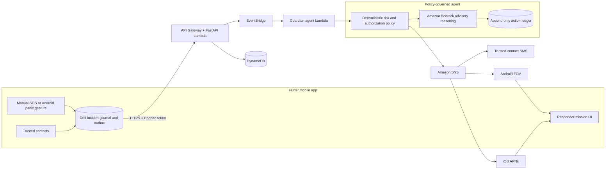

# Guardian

**A safety-orchestration MVP for durable SOS reporting, trusted-contact escalation, and controlled nearby-responder coordination.**

[](https://github.com/kunaldrafts25/Guardian/actions/workflows/flutter_ci.yml)
[](https://flutter.dev/)
[](https://aws.amazon.com/serverless/sam/)
[](LICENSE)

Guardian combines a Flutter mobile client, Android-native emergency handling, and an AWS serverless backend. An emergency incident is recorded locally first, synchronized through an authenticated API, evaluated by deterministic safety policy, and then optionally enriched by Amazon Bedrock advisory reasoning. Trusted contacts and a closed cohort of approved responders can receive real notifications without exposing precise location before authorization.

> [!IMPORTANT]
> Guardian is a controlled MVP, not an emergency-service replacement. It does not contact police, ambulance, or other public emergency services automatically. Delivery depends on device permissions, operating-system restrictions, carrier/network availability, and correctly deployed cloud infrastructure.

## What works today

- Hold-to-activate SOS with a cancellation window and an evidence-backed incident timeline.
- Durable local incident journal and retry queue for interrupted or offline requests.
- Android foreground protection service with a configurable rapid screen/power-toggle panic gesture.
- Android direct-SMS fallback to configured trusted contacts when permission and cellular service are available.
- Phone-number authentication through Amazon Cognito custom challenges.
- Authenticated incident, session, contact, device, and responder APIs.
- Targeted push delivery through Amazon SNS: FCM on Android and native APNs on iOS.
- Deterministic emergency policy with optional Amazon Bedrock advisory reasoning.
- Signed, short-lived, single-use authorization for safety-critical agent tools.
- Append-only decision and execution ledger for agent actions.
- Closed, manually approved responder cohort with coarse invitations.
- Conditional mission lifecycle: `INVITED → ACCEPTED → EN_ROUTE → ARRIVED → COMPLETED`.
- Precise-location grants that are issued only after acceptance and revoked at terminal states.
- OpenStreetMap-based map display and navigation hand-off.
- Light and dark semantic themes with compact-screen and large-text component coverage.

## Safety boundaries

Guardian intentionally does not claim capabilities the operating systems or current product cannot guarantee:

- Android hardware-trigger behavior varies by manufacturer and requires the protection service to be enabled.
- iOS does not permit third-party apps to intercept arbitrary power-button presses. iOS activation must use supported system surfaces or the in-app SOS flow.
- The responder network is not a public marketplace. Responders must be manually reviewed and approved.
- Bedrock is advisory. It cannot suppress or downgrade deterministic handling of an explicit panic event.
- A push or SMS submission is not represented as delivered unless real delivery evidence exists.
- BLE mesh relaying, wearable integration, and fall-detection ML are outside the current product scope.

## Architecture



The key authority boundary is simple: the model may recommend and explain, but deterministic policy decides whether a safety-critical tool is allowed. Approved actions require an incident-bound capability, and capability consumption is atomic to prevent replay.

## Technology

| Layer | Implementation |
| --- | --- |
| Mobile | Flutter, Dart, Riverpod, go_router |
| Local durability | Drift and SQLite |
| Android native | Kotlin foreground service, encrypted emergency snapshot, SMS fallback |
| Maps and location | flutter_map, OpenStreetMap, geolocator |
| API | FastAPI on AWS Lambda through Mangum and API Gateway |
| Identity | Amazon Cognito phone custom challenge |
| Data | DynamoDB with conditional writes, TTL, and point-in-time recovery |
| Events and reasoning | EventBridge, deterministic policy, Amazon Bedrock |
| Notifications | Amazon SNS, FCM, APNs, SMS |
| Infrastructure | AWS SAM / CloudFormation |

## Repository layout

```text
Guardian/
├── android/        Android host app and native emergency services
├── ios/            iOS runner, entitlements, CocoaPods configuration
├── lib/
│   ├── app/        Routing, theme, and application shell
│   ├── core/       Database, models, providers, services, shared UI
│   └── features/   Auth, dashboard, emergency, map, responder, settings
├── aws/
│   ├── agent/      Policy authorization, reasoning, tools, and ledger
│   ├── tests/      Backend unit and API tests
│   ├── server.py   Authenticated API surface
│   └── template.yaml  AWS SAM infrastructure definition
├── test/           Flutter unit, database, service, and widget tests
└── .github/        Android, iOS, Flutter, backend, and SAM CI
```

## Prerequisites

- Flutter `3.47.4`
- Dart version bundled with Flutter
- JDK 17
- Android Studio and Android SDK 36 for Android builds
- Python 3.12 for backend tests and local development
- AWS CLI and AWS SAM CLI for cloud deployment
- macOS, Xcode, CocoaPods, and an Apple Developer account for signed iOS builds

Check the local toolchain:

```powershell
flutter doctor -v
python --version
sam --version
aws --version
```

## Run the mobile app

Install packages:

```powershell
flutter pub get
```

Guardian does not use a runtime `.env` loader. For Android, download the real `google-services.json` for package `com.company.guardian` from Firebase and place it at `android/app/google-services.json`. The file is intentionally ignored by Git, and Gradle applies the Google Services plug-in automatically when it is present.

Firebase can alternatively be configured with build-time values. This is useful for CI and environment-specific builds:

```powershell
flutter run `
  --dart-define=AWS_API_ENDPOINT=https://YOUR_API_ENDPOINT `
  --dart-define=FIREBASE_API_KEY=YOUR_FIREBASE_API_KEY `
  --dart-define=FIREBASE_PROJECT_ID=YOUR_FIREBASE_PROJECT_ID `
  --dart-define=FIREBASE_MESSAGING_SENDER_ID=YOUR_SENDER_ID `
  --dart-define=FIREBASE_ANDROID_APP_ID=YOUR_ANDROID_APP_ID
```

For iOS, use a real `GoogleService-Info.plist` in the Runner target or replace `FIREBASE_ANDROID_APP_ID` with these build-time values:

```text
FIREBASE_IOS_APP_ID
FIREBASE_IOS_BUNDLE_ID=com.company.guardian
```

`FIREBASE_STORAGE_BUCKET` is optional. Release builds require a valid HTTPS `AWS_API_ENDPOINT`.

## Validate the project

Run the same core checks used by CI:

```powershell
dart format --output=none --set-exit-if-changed lib test
flutter analyze --no-fatal-infos
flutter test
python -m pip install --requirement aws/requirements-test.txt
python -m pytest aws/tests --quiet
sam validate --lint --template-file aws/template.yaml
sam build --template-file aws/template.yaml
```

Current verified baseline:

- 145 Flutter tests passing.
- 71 backend tests passing (pytest).
- Android signed release APK builds in CI.
- iOS simulator build passes in CI.
- SAM template validation and packaging pass in CI.
- Zero static analysis errors or warnings (`flutter analyze --no-fatal-infos`).

The CI signing key is ephemeral and must never be used for distribution.

## Build release artifacts

Android releases require all four signing environment variables:

```text
GUARDIAN_KEYSTORE_PATH
GUARDIAN_KEYSTORE_PASSWORD
GUARDIAN_KEY_ALIAS
GUARDIAN_KEY_PASSWORD
```

Build the Play Store App Bundle with the same AWS/Firebase Dart defines used above:

```powershell
flutter build appbundle --release `
  --dart-define=AWS_API_ENDPOINT=https://YOUR_API_ENDPOINT `
  --dart-define=FIREBASE_API_KEY=YOUR_FIREBASE_API_KEY `
  --dart-define=FIREBASE_PROJECT_ID=YOUR_FIREBASE_PROJECT_ID `
  --dart-define=FIREBASE_MESSAGING_SENDER_ID=YOUR_SENDER_ID `
  --dart-define=FIREBASE_ANDROID_APP_ID=YOUR_ANDROID_APP_ID
```

Verify iOS dependencies and compilation on macOS before signing:

```bash
flutter pub get
cd ios && pod install && cd ..
flutter build ios --simulator --no-codesign
```

A production iOS archive additionally requires an Apple team, distribution signing, Push Notifications capability, APNs credentials, and production Dart defines.

## Deploy the AWS backend

The SAM template creates isolated resources for each environment. Always use `EnvironmentName=staging` first and a separate `EnvironmentName=production` deployment later.

```powershell
sam validate --lint --template-file aws/template.yaml
sam build --template-file aws/template.yaml
sam deploy --guided --region ap-south-1
```

The deployment prompts for:

| Parameter | Purpose |
| --- | --- |
| `EnvironmentName` | Resource isolation, for example `staging` or `production` |
| `FcmPlatformApplicationArn` | Existing SNS platform application for Android FCM |
| `ApnsPlatformApplicationArn` | Existing SNS APNs sandbox or production application |

Never commit AWS credentials, Firebase service-account JSON, APNs keys, Android keystores, Apple signing material, or production tokens.

## Before real-user distribution

Automated builds are green, but production readiness still requires work that cannot be completed with repository code alone:

1. Deploy isolated staging and production AWS stacks.
2. Configure FCM HTTP v1, APNs sandbox/production, SMS production access, Cognito, and Bedrock.
3. Test the complete protected-user and responder journey on physical Android and iOS devices.
4. Use real Android and Apple distribution identities and controlled store test tracks.
5. Publish privacy, terms, retention, support, abuse-reporting, and account-deletion policies.
6. Implement and verify self-service account deletion before unrestricted public-store release.
7. Keep public responder enrolment disabled until identity review, reporting, suspension, and appeal operations exist.
8. Monitor notification failures, OTP delivery, incident persistence, authorization denials, and crash/ANR rates during gradual rollout.

## Security

Do not report exploitable vulnerabilities in a public issue. Share them privately with the repository owner and include reproduction steps, affected commit, impact, and any proposed mitigation. Never include real phone numbers, location data, tokens, or credentials in a report.

## License

Guardian is available under the [MIT License](LICENSE).
