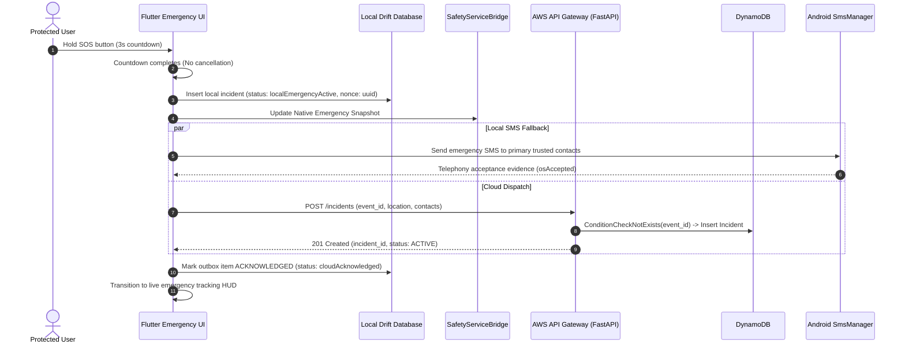
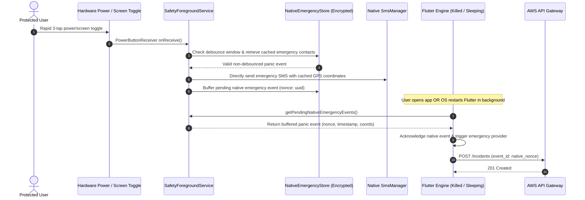
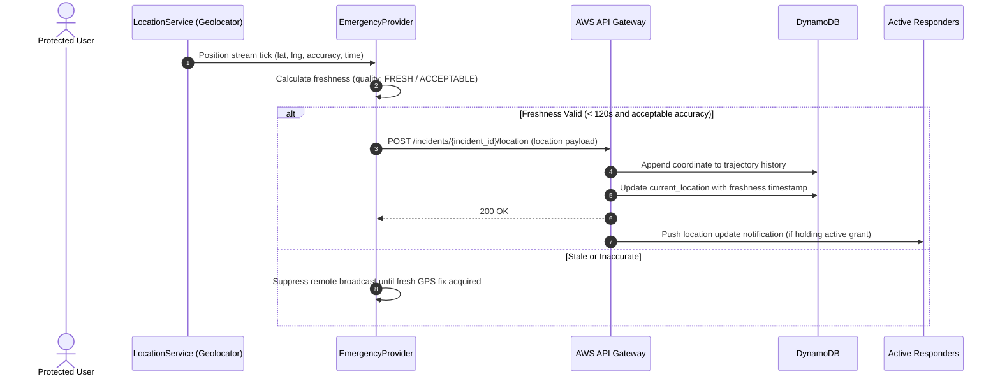
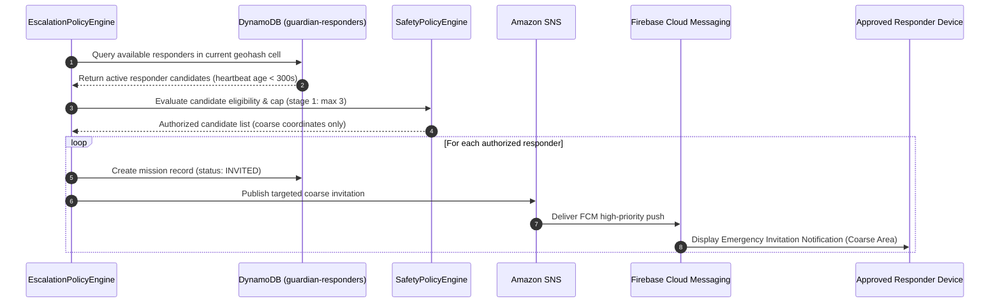
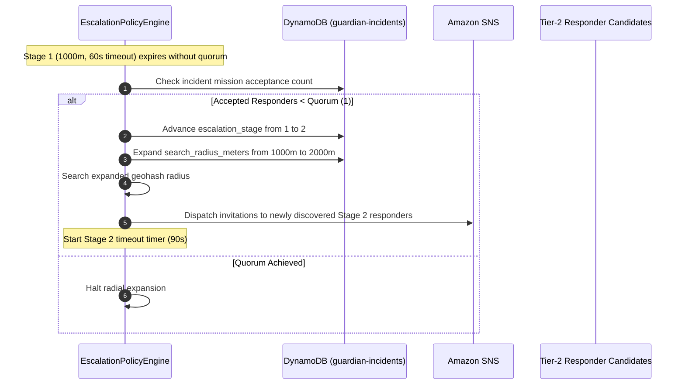
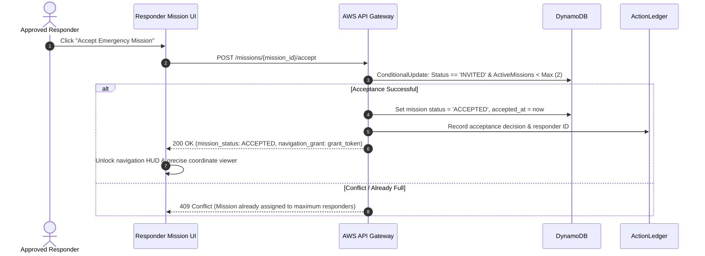
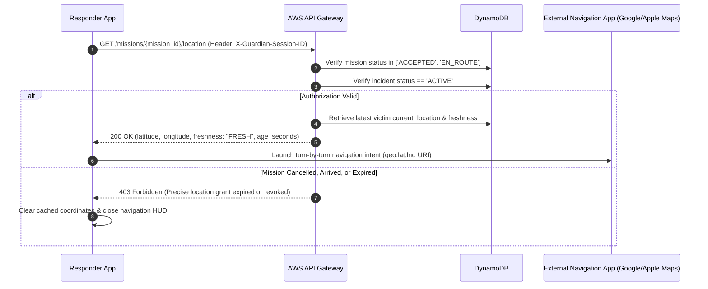
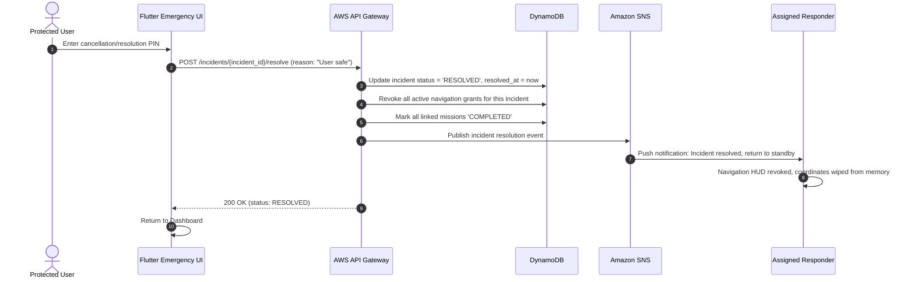

# Guardian Post-Remediation System Architecture & Invariants

This document outlines the architecture, component relationships, data flows, and safety-critical execution sequences of Guardian across mobile clients (Flutter, Android native, iOS native), local durability layers (Drift/SQLite), cloud infrastructure (AWS API Gateway, FastAPI Lambda, DynamoDB, EventBridge, Amazon SNS, Amazon Bedrock), and mapping services (OpenStreetMap & OSRM).

---

## 1. High-Level Component Architecture Map

```mermaid
flowchart TB
    subgraph MobileDevice["Mobile Device (Android / iOS)"]
        subgraph FlutterApp["Flutter Application Layer"]
            UI["UI / Presentation (GoRouter, Riverpod)"]
            SosTrigger["SosTriggerProvider (Hold SOS, Volume/Screen Listeners)"]
            EmergencyProvider["EmergencyProvider (12-Stage Lifecycle)"]
            LocationSvc["LocationService (GPS, Freshness Filter)"]
            HeartbeatProvider["ResponderHeartbeatProvider (TTL & Availability)"]
            OfflineSync["OfflineSyncService (Outbox Queue Worker)"]
        end

        subgraph LocalDurability["Local Persistence Layer"]
            DriftDB[("Drift SQLite Database\n(Encrypted Outbox, Incidents, Contacts)")]
        end

        subgraph AndroidNative["Android Native Layer (Kotlin Foreground Service)"]
            Service["SafetyForegroundService (Foreground Notification)"]
            NativePanic["PowerButtonReceiver & NativeEmergencyDispatcher"]
            NativeStore["NativeEmergencyStore (Encrypted Master Snapshot)"]
            SmsMgr["SmsManager (Direct Cellular Telephony Dispatch)"]
        end
    end

    subgraph AWSCloud["AWS Cloud Infrastructure (ap-south-1)"]
        APIGW["Amazon API Gateway (REST API + Auth Rate Limits)"]
        AuthMiddleware["FastAPI Lambda Middleware\n(Cognito JWT Validation + X-Guardian-Session-ID Verification)"]
        
        subgraph ServerlessCore["Core Serverless Application"]
            Server["FastAPI Application Surface (aws/server.py)"]
            AuthSvc["Session & Auth Service"]
            IncidentHandler["Incident Lifecycle & Trajectory Engine"]
            EscalationEngine["Progressive Escalation Policy Engine\n(1km -> 2km -> 5km -> 10km)"]
        end

        subgraph CloudStorage["Persistence & Ledger"]
            DDB_Users[("DynamoDB: Users & Sessions")]
            DDB_Incidents[("DynamoDB: Incidents & Missions")]
            DDB_Responders[("DynamoDB: Responders & Geohashes")]
            ActionLedger[("DynamoDB: Append-Only Audit Ledger")]
        end

        subgraph SafetyAI["Safety Governance & Advisory Engine"]
            SafetyPolicy["Deterministic Risk & Capability Policy\n(Strict Invariants, Capability Minting)"]
            Bedrock["Amazon Bedrock (Claude / Nova Advisory Summarization)"]
        end

        subgraph Notifications["Outbound Notifications"]
            SNS["Amazon SNS (Topic & Direct Push)"]
            FCM["Firebase Cloud Messaging (Android FCM HTTP v1)"]
            APNs["Apple Push Notification service (iOS APNs)"]
            AwsSms["AWS SNS SMS (Trusted Contacts Cloud Fallback)"]
        end
    end

    subgraph ExternalServices["External Navigation & Mapping"]
        OSRM["OSRM Walking Router (Free Foot Routing)"]
        OSM["OpenStreetMap Nominatim & Tile Servers"]
        ExternalNav["External Turn-by-Turn GPS (Google Maps / Apple Maps Intent)"]
    end

    %% Mobile Internal Wiring
    SosTrigger --> EmergencyProvider
    EmergencyProvider --> DriftDB
    EmergencyProvider --> NativeStore
    OfflineSync --> DriftDB
    OfflineSync --> APIGW
    EmergencyProvider --> APIGW
    LocationSvc --> EmergencyProvider
    HeartbeatProvider --> APIGW
    NativePanic --> NativeStore
    NativePanic --> SmsMgr
    NativePanic -.-> EmergencyProvider

    %% Cloud Wiring
    APIGW --> AuthMiddleware
    AuthMiddleware --> Server
    Server --> AuthSvc
    Server --> IncidentHandler
    Server --> EscalationEngine
    AuthSvc --> DDB_Users
    IncidentHandler --> DDB_Incidents
    EscalationEngine --> DDB_Responders
    EscalationEngine --> SafetyPolicy
    SafetyPolicy --> Bedrock
    SafetyPolicy --> ActionLedger
    EscalationEngine --> SNS
    SNS --> FCM
    SNS --> APNs
    SNS --> AwsSms

    %% Mapping Wiring
    UI --> OSM
    UI --> OSRM
    UI -.-> ExternalNav
```



---

## 2. Security, Boundary & Authority Invariants

1. **Deterministic Authority Boundary**: Amazon Bedrock is **strictly advisory**. Bedrock cannot authorize emergency actions, mint capability tokens, downgrade a panic alert, or modify an incident state. All safety-critical actions are evaluated by deterministic policy rules in `aws/agent/policy.py`.
2. **Atomic Single-Use Capabilities**: Sensitive tool invocations (e.g., dispatching SMS, notifying responders, granting precise coordinates) require cryptographically signed capability tokens with short TTLs (120s) and atomic consumption to prevent replay attacks.
3. **Session Enforcement**: Every authenticated private endpoint mandates both a valid Cognito Bearer JWT and an active `X-Guardian-Session-ID`. Session revocation terminates access immediately.
4. **Data Minimization (Coarse vs Precise)**: Prior to responder mission acceptance, only coarse locations (obfuscated or neighborhood radius) are distributed. Precise coordinates require an accepted mission and an active, short-lived navigation grant.
5. **Grant Revocation**: Precise location access is immediately revoked upon:
   - Responder reaching arrival perimeter (`ARRIVED`)
   - Mission completion or withdrawal (`COMPLETED`, `WITHDRAWN`)
   - Incident conclusion (`RESOLVED`, `CANCELLED`)

---

## 3. Sequence Diagrams

### 1. Manual SOS Sequence (In-App Hold-to-Activate)



---

### 2. Offline SOS Sequence (Durability & Outbox Synchronization)

```mermaid
sequenceDiagram
    autonumber
    actor Victim as Protected User
    participant UI as Flutter Emergency UI
    participant Drift as Local Drift Database
    participant Native as Android SmsManager
    participant Sync as OfflineSyncService
    participant Backend as AWS API Gateway

    Victim->>UI: Trigger SOS (No internet connectivity)
    UI->>Drift: Persist incident in Outbox (status: PENDING_SYNC, nonce: uuid)
    UI->>Native: Dispatch direct cellular SMS to contacts
    Native-->>UI: SMS dispatched via cellular network
    UI->>UI: Display Offline Emergency HUD (SMS sent, Cloud pending)
    
    Note over Sync,Backend: Time passes; network connectivity is restored
    
    Sync->>Drift: Query pending outbox entries
    Drift-->>Sync: Return pending SOS incident
    Sync->>Backend: POST /incidents (event_id: uuid, timestamp: T0, location)
    Backend-->>Sync: 201 Created (incident_id: inc-123)
    Sync->>Drift: Update outbox record (synced: true, cloud_incident_id: inc-123)
    Sync->>UI: Notify emergency state updated (cloudAcknowledged)
```

---

### 3. Android No-Flutter SOS (Native Hardware Panic Trigger)



---

### 4. Victim Location Update Sequence



---

### 5. Responder Discovery Sequence



---

### 6. Radius Expansion Sequence (Progressive Escalation)



---

### 7. Responder Acceptance Sequence



---

### 8. Exact Location Authorization Sequence



---

### 9. Incident Resolution Sequence


